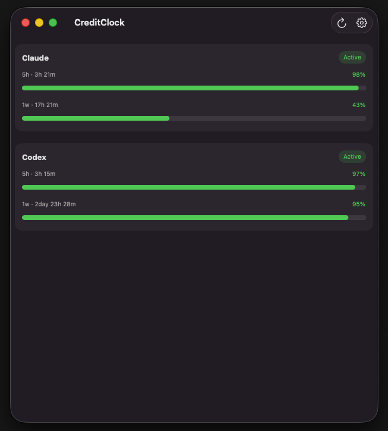
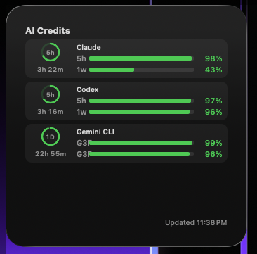
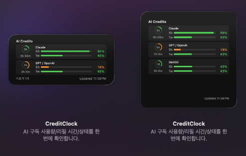

[English](./README.md) | [한국어](./README.ko.md)

<h1 align="center">CreditClock</h1>

<p align="center">
  AI 구독 사용량, 리필 시간, 플랜 상태를 한 화면에서 확인하세요.
  <br />
  Codex, Claude, Gemini를 위한 macOS 앱 + 데스크탑 위젯입니다.
</p>

<p align="center">
  
  
  
  
</p>

## 스크린샷

<p align="center">
  
</p>

<p align="center">
  
</p>

<p align="center">
  
</p>

## CreditClock로 할 수 있는 것

- 여러 AI 서비스 사용량을 한 대시보드에서 통합 확인
- `5h`, `1w`, 일 단위 등 리필 카운트다운 확인
- 구독 상태(`Active`, `Trial`, `Paused`, `Expired`) 빠른 파악
- WidgetKit 위젯(`systemMedium`, `systemLarge`)으로 데스크탑에서 바로 확인
- 메뉴바에서 즉시 상태 확인 및 수동 리프레시

## 지원 Provider

| Provider | 데이터 소스 | 앱에서 설정 방법 |
|---|---|---|
| Codex (`OpenAI`) | 로컬 `~/.codex` 사용량 캐시/세션 로그, JWT fallback | 로컬 폴더 권한 승인 + `Connect` |
| Claude (`Anthropic`) | 로컬 `~/.claude/plugins/oh-my-claudecode/.usage-cache.json` 또는 Anthropic OAuth usage endpoint | 로컬 폴더 권한 승인 + `Connect` |
| Gemini | 로컬 `~/.gemini/oauth_creds.json` (CLI OAuth 쿼터) 또는 Gemini API 키 fallback | CLI OAuth를 위한 로컬 폴더 권한 승인, 또는 API 키 저장 + 활성화 |

## 설치 방법 (macOS)

사전 준비:

- macOS 14 이상
- Xcode 15 이상
- Homebrew + `xcodegen`

```bash
brew install xcodegen
xcodegen generate
open CreditClock.xcodeproj
```

Xcode에서 `CreditClock` 스킴을 실행하세요.

## 사용 방법

1. `CreditClock` 앱을 실행합니다.
2. 우측 상단 톱니 버튼으로 `Settings`를 엽니다.
3. `Local Data Access`에서 `Grant Codex + Claude + Gemini Together (Recommended)`를 누릅니다.
4. 홈 폴더(`~`)를 1회 선택합니다.
5. Provider를 설정합니다.
   - `OpenAI`, `Anthropic`: `Connect` 클릭
   - `Gemini`: 로컬 CLI OAuth(`~/.gemini/oauth_creds.json`)를 사용하거나 API 키를 저장
6. Provider별 `Test` 실행 (선택이지만 권장)
7. 설정 창을 닫고 메인 화면에서 `Refresh`를 누릅니다.
8. 데스크탑에 CreditClock 위젯을 추가합니다.

> 설치 안내 (2026-02-17 기준): CreditClock는 아직 코드사이닝되지 않아 실제 설치/실행은 Xcode에서 `CreditClock` 스킴으로 직접 진행해야 합니다.

## 문제 해결

- `No providers configured`: `Settings`에서 최소 1개 Provider를 연결하세요.
- 위젯에 `No synced data` 표시: 앱에서 `Refresh` 1회 후 위젯을 제거/재추가하세요.
- 폴더 권한 오류: `Settings`에서 로컬 권한을 다시 승인하세요.

## 개인정보/보안

- 로컬 Provider 데이터는 사용자 기기 경로(`~/.codex`, `~/.claude`, `~/.gemini`)에서 읽습니다.
- API 키는 macOS Keychain에 저장됩니다.
- 앱-위젯 동기화는 App Group + 로컬 fallback 경로를 함께 사용합니다.

<details>
<summary><strong>Development</strong></summary>

### 기술 스택

- Swift 5.10
- SwiftUI (macOS 앱)
- WidgetKit (데스크탑 위젯)
- XcodeGen (`project.yml` 기반 프로젝트 생성)

### 프로젝트 구조

```text
CreditClock/
├── CreditClockApp/                 # macOS 앱 (메인 화면 + 설정 + 메뉴바)
├── CreditClockWidget/              # WidgetKit 확장
├── Shared/
│   ├── Models/                     # 스냅샷/상태 모델
│   ├── Persistence/                # App Group, fallback 저장소, keychain 래퍼
│   ├── Providers/                  # OpenAI/Anthropic/Gemini 어댑터
│   └── Store/                      # 리프레시 오케스트레이션 + 폴링
├── scripts/                        # 타입체크, 버전 증가, 릴리스 스크립트
└── project.yml                     # XcodeGen 기준 파일
```

### 로컬 개발

```bash
# Xcode 프로젝트 생성
xcodegen generate

# pre-commit과 동일한 Swift 타입체크 실행
./scripts/typecheck.sh
```

### Pre-commit 자동화

`.husky/pre-commit`에서 아래 순서로 실행합니다.

1. `scripts/bump-version.sh`
   - `VERSION` 패치 버전 증가
   - `Shared/Generated/BuildVersion.generated.swift` 재생성
2. `scripts/typecheck.sh`

새 클론에서 훅 활성화:

```bash
git config core.hooksPath .husky
```

필요 시 1회 버전 증가 스킵:

```bash
CREDITCLOCK_SKIP_VERSION_BUMP=1 git commit -m "your message"
```

### 빌드 / 릴리스 스크립트

```bash
# unsigned Release 앱 빌드 + zip 아티팩트 생성
./scripts/build-release-artifact.sh

# main-latest GitHub release 업로드/갱신 (gh auth 필요)
./scripts/upload-main-release.sh
```

### 데이터 동기화 참고

- 기본 동기화: App Group 컨테이너 (`group.com.creditclock.shared`)
- fallback: `~/.creditclock/snapshots.json`
- 위젯 브리지 fallback: `~/Library/Containers/com.creditclock.app.widget/Data/Documents/snapshots.json`

</details>

## 라이선스

MIT License. 자세한 내용은 [LICENSE](./LICENSE)를 확인하세요.
